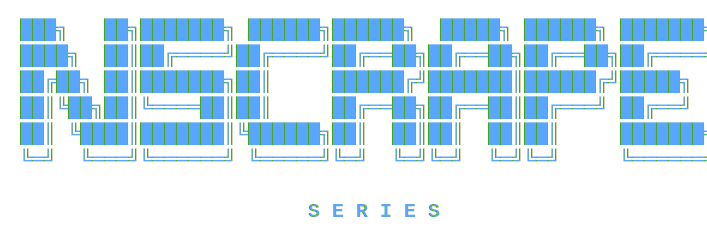

<div align="center">

<br/>



### Extract anything. From anywhere. Without limits.

**Three focused tools. One philosophy. Zero setup.**

<br/>


<br/>

> Every tool in this series ships as Docker images. No source code. No build step. Pull and run.

<br/>

</div>

---

## What is the NScrape Series?

The **NScrape Series** is a collection of purpose-built data extraction tools — each one solving a specific scraping problem, each deployable with a single `docker compose up`.

They share one design philosophy:

| Principle | What it means |
|---|---|
| 🐳 **Docker-first** | Zero local dependencies — pull the images and run |
| 🎨 **UI-first** | Every tool has a web interface. No terminal required for normal use |
| 📤 **Export-ready** | Every result can be downloaded as PDF, DOCX, ZIP, or structured JSON |
| 🔌 **API-first** | Every tool exposes a REST API with Swagger docs for programmatic use |
| 🔧 **Configurable** | Ports, workers, thresholds — all tunable via environment variables |

---

## Overview

Three **independently built and published** data extraction tools, each solving a different scraping problem and shipped as **production Docker images** — pull, run, done. Every tool exposes a **REST API** (Swagger docs included), a **web UI**, and configurable **export formats** (PDF, DOCX, ZIP, JSON).

- **LetsNScrape** — general-purpose scraper with a **dual-engine pipeline** (HTTP + **Playwright**), auto-switching for JS-rendered sites.
- **SnapNScrape** — scraping with an **OCR failsafe** (Playwright screenshot + **Tesseract**) for bot-blocked or JS-hostile pages.
- **ytNscrape** — a **9-service pipeline** (yt-dlp + ffmpeg + a MiniLM embedding model) that turns YouTube lectures into deduplicated, captioned **study PDFs**.

**Core skills demonstrated:** `Docker` · `Docker Compose` · `FastAPI` · `Playwright` · `OCR / Tesseract` · `Redis` · `REST API design` · `Swagger/OpenAPI` · `yt-dlp` · `Microservice architecture` · `CI/CD image publishing`

---

## Live Deployment

This repo covers the tools. To see them running in **production on AWS + self-managed Kubernetes**, with Ansible, Helm, and Prometheus/Grafana monitoring — check out **[NSeries Platform Engineering](https://github.com/pratham1kruk/NSeries-Platform-Engineering)**. Full breakdown in [`execution-results/assets/demo-link.md`](execution-results/assets/demo-link.md).

---

## Repo Architecture

```
├── execution-results/
│   └── assets/
│       ├── .gitkeep
│       ├── demo-link.md
│       └── nscrape-banner.svg
├── .gitignore
├── .vbcignore
├── letsNscrape_documentation.md
├── README.md
├── snapNscrape_documentation.md
└── ytNscrape_documentation.md
```

> This README covers each tool at a high level only. For **setup, configuration, API reference, and troubleshooting**, always refer to the dedicated documentation file for that tool:
> - [`letsNscrape_documentation.md`](letsNscrape_documentation.md)
> - [`ytNscrape_documentation.md`](ytNscrape_documentation.md)
> - [`snapNscrape_documentation.md`](snapNscrape_documentation.md)

---

## The Tools

| Tool | Purpose | Images | UI Port | Status |
|------|---------|--------|:-------:|:------:|
| 🕷️ [**LetsNScrape**](#-letsnscape) | General-purpose web scraper — any URL, any data type | `letsnscape-backend` · `letsnscape-frontend` | **3071** | `v1.0.0` ✅ |
| ⚡ [**ytNscrape**](#-ytnscrape) | YouTube lecture scraper — slide frames + captions + study PDF | 9 service images | **3000** | `v1.0.0` ✅ |
| 📸 [**SnapNScrape**](#-snapnscrape) | Web scraping with OCR failsafe — handles bot-blocked sites | `snapnscrape-gateway` · `snapnscrape-scraper` | **3030** | `v1.0.0` ✅ |

---

## Quick Comparison

| | 🕷️ LetsNScrape | ⚡ ytNscrape | 📸 SnapNScrape |
|---|---|---|---|
| **Input** | Any URL | YouTube URL | Any URL |
| **Engine** | HTTP + Playwright | yt-dlp + ffmpeg | HTTP + Playwright + OCR |
| **Output** | Text, links, images, tables, metadata | PDF notes, ZIP slides, captions | Extracted text |
| **Export** | PDF, DOCX | PDF, ZIP | DOCX |
| **Caching** | Redis job store | Redis job queue | Redis 1-hour cache |
| **Multi-page** | ✅ Up to 50 pages, depth 3 | ❌ Single video | ❌ Single URL |
| **Handles JS sites** | ✅ Auto-detect + Playwright | N/A | ✅ OCR fallback |
| **Handles bot-blocked sites** | ⚠️ Playwright fallback | N/A | ✅ Screenshot + OCR |
| **RAM needed** | 2 GB | 4–8 GB | 2 GB |
| **Containers** | 3 | 9+ | 3 |

---
---

## 🕷️ LetsNScrape

> **The web is your database. LetsNScrape is your query.**

A **general-purpose web scraper** that extracts exactly the data you need from any webpage. Text, images, links, metadata, headings, tables — individually or all at once. Handles both static HTML sites and JavaScript-rendered SPAs.

### What problem it solves

Most scrapers fail on modern sites. LetsNScrape runs a **dual-engine pipeline** — fast HTTP scrape first, then automatic Playwright fallback for JS-heavy sites. It auto-detects which engine is needed; you don't have to choose.

### Architecture

```
╔══════════════════════════════════════════════════════════════════╗
║  letsnscape-frontend  :3071   React UI + Nginx reverse proxy     ║
║  letsnscape-backend   :3070   FastAPI scraping API               ║
║  letsnscape-redis     :6380   Async job queue + result store     ║
╚══════════════════════════════════════════════════════════════════╝
                          |
              ┌───────────┴───────────┐
              ▼                       ▼
         Scrapy / HTTP           Playwright
         (static sites,         (React, Vue, Angular,
          fast path)             Next.js — auto-switched)
```

📖 **Full setup guide, port/config reference, API docs, and troubleshooting:** [`letsNscrape_documentation.md`](letsNscrape_documentation.md)

---
---

## ⚡ ytNscrape

> **Paste a YouTube lecture URL. Get a note-ready PDF and a ZIP of clean slide frames — automatically.**

A **YouTube lecture scraper** that downloads a video, extracts and deduplicates slide frames by content type, syncs captions, and renders everything into a study-ready PDF and ZIP — fully automated.

### What problem it solves

Watching a lecture to take notes is slow. Pausing to screenshot slides is tedious. ytNscrape processes the entire video in the background and hands you a structured notes PDF with ruled lines for handwriting, plus a ZIP of every unique slide frame labelled by type (code, software UI, or slide).

### Pipeline

| Stage | What happens |
|:-----:|-------------|
| 1 | **Download** — yt-dlp fetches video + caption track |
| 2 | **Extract** — ffmpeg pulls frames at 1 fps |
| 3 | **Dedup (Stage 1)** — perceptual hash removes near-identical frames |
| 4 | **Priority Extract** — OCR + MiniLM classifies P1 (code), P2 (software UI), P3 (slides); deduplicates per tier |
| 5 | **Post-process** — letterbox crop, sharpen, save as lossless PNG |
| 6 | **Caption sync** — VTT timestamps aligned to surviving frames |
| 7 | **Render ZIP** — clean PNGs + `manifest.json` + `captions.txt` |
| 8 | **Render PDF** — A4, 2 slides/page, captions, ruled lines for notes |

### Architecture

```
Frontend  :3000  (nginx + vanilla JS)
  └── Gateway  :3082  (FastAPI + SSE live progress)
        └── Redis job queue  :3061
              ├── svc-ingest       yt-dlp + ffmpeg
              ├── svc-dedup        pHash dedup
              ├── svc-priority     OCR + MiniLM
              ├── svc-postprocess  Pillow crop/sharpen
              ├── svc-captions     VTT sync
              ├── svc-render-zip   ZIP output
              └── svc-render-pdf   PDF output
                        └── MinIO  :9000 / :9001
```

📖 **Full setup guide, port/config reference, API docs, and troubleshooting:** [`ytNscrape_documentation.md`](ytNscrape_documentation.md)

---
---

## 📸 SnapNScrape

> **Extract any web content. Without limits.**

A **containerised web scraping platform** with a three-stage intelligent pipeline. Built for sites that actively block bots, rely on JavaScript rendering, or hide content behind dynamic layers. When HTTP fails and Playwright fails, it screenshots the page and reads the text with Tesseract OCR.

### What problem it solves

| Problem | How SnapNScrape handles it |
|---|---|
| Website blocks HTTP bots | Falls back to real Chromium via Playwright |
| Content loaded by JavaScript | Browser renders the full page before capturing |
| No public API on the site | Screenshot + Tesseract OCR reads text from the visual page |
| Slow repeated scraping | Redis caches results for 1 hour |
| Need output in a document | One-click DOCX export on every result |

### Architecture

```
Gateway  :${PORT}  (Web UI · REST API · DOCX export · Redis cache)
  └── Scraper  :8001  (internal only — never exposed)
        ├── Stage 1 — HTTP scrape  (httpx + BeautifulSoup4)  fast path
        └── Stage 2 — OCR failsafe (Playwright Chromium + Tesseract)
Redis  :6379  (result cache — internal only)
```

📖 **Full setup guide, port/config reference, API docs, and troubleshooting:** [`snapNscrape_documentation.md`](snapNscrape_documentation.md)

---

<div align="center">

<br/>

**Built by [pratham1uk](https://hub.docker.com/r/pratham1uk) · NScrape Series**

[](https://hub.docker.com/r/pratham1uk/letsnscrape-backend)
[](https://hub.docker.com/r/pratham1uk/letsnscrape-frontend)
[](https://hub.docker.com/r/pratham1uk/ytnscrape-gateway)
[](https://hub.docker.com/r/pratham1uk/snapnscrape-gateway)
[](https://hub.docker.com/r/pratham1uk/snapnscrape-scraper)
[](https://hub.docker.com/r/pratham1uk/ytnscrape-frontend)
[](https://hub.docker.com/r/pratham1uk/ytnscrape-svc-ingest)
[](https://hub.docker.com/r/pratham1uk/ytnscrape-svc-dedup)
[](https://hub.docker.com/r/pratham1uk/ytnscrape-svc-priority)
[](https://hub.docker.com/r/pratham1uk/ytnscrape-svc-postprocess)
[](https://hub.docker.com/r/pratham1uk/ytnscrape-svc-captions)
[](https://hub.docker.com/r/pratham1uk/ytnscrape-svc-render-zip)
[](https://hub.docker.com/r/pratham1uk/ytnscrape-svc-render-pdf)
[](https://hub.docker.com/r/pratham1uk/letsnscape-backend)
[](https://hub.docker.com/r/pratham1uk/letsnscape-frontend)
[](https://hub.docker.com/r/pratham1uk/snapnscrape-gateway)
[](https://hub.docker.com/r/pratham1uk/snapnscrape-scraper)

<br/>

</div>